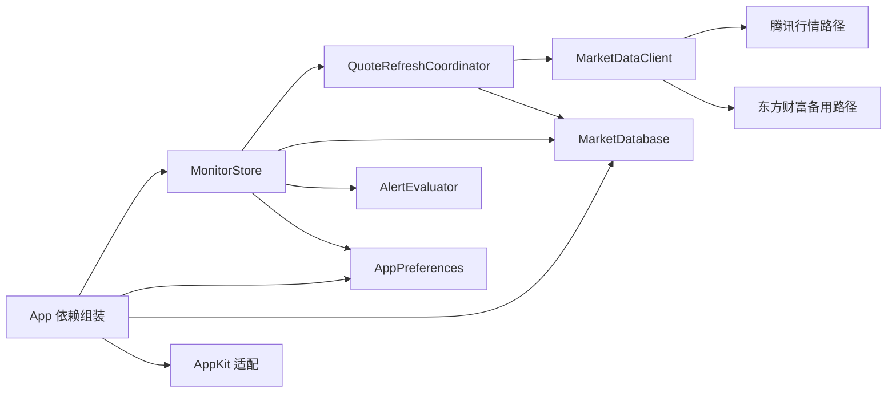

# MarketSprite 架构

## 目标

MarketSprite 是一个 local-first、单用户的 macOS 桌面行情工具。当前架构优先保证接口小、职责明确、本地数据可靠，再考虑 Agent、策略、TUI 或全市场扫描。

当前明确不做持仓核算、券商接入、订单、自动交易，也不放置 Pi/Agent 占位代码。未来能力只有在真实实现和测试适配都存在时，才建立新的接口。

## 能力目录

```text
MarketSprite/
├── App/         依赖组装、应用身份和 Scene 生命周期
├── Monitor/     Watchlist 运行态、刷新编排和桌面行情 UI
├── MarketData/  市场模型、提供方无关身份和行情适配
├── Alerts/      提醒规则、评估、展示和声音
├── Settings/    应用偏好和设置 UI
├── Database/    唯一的 SQLite / GRDB 实现
├── Platform/    AppKit 窗口和全局快捷键适配
└── Resources/   本地化、图标和声音资源

MarketSpriteTests/
├── Alerts/
├── Database/
├── MarketData/
├── Monitor/
├── Settings/
└── Support/

MarketSpritePerformanceTests/  独立性能基线 target，不扩大生产接口
```

这些目录是一个应用 target 内的能力划分，不是多个 Swift Package。只有当新 package 或 protocol 形成真实 seam，而不是转发调用时，才应该引入。

## 运行流程



`AppBootstrap` 先打开 `marketsprite-v3.sqlite`，再调用 `MonitorStore.start()` 恢复 Watchlist、缓存行情和提醒数据。只有数据库打开与本地恢复全部成功后，应用才进入可用状态并启动行情刷新；失败时不会降级为内存数据库，而是进入只提供重试、显示目录和退出操作的数据库错误状态。刷新失败时保留最后一次成功快照，并把标的标记为 stale。

`MonitorStore` 合并相同 Watchlist revision 的刷新调用，并在成员变化时取消旧批次。`QuoteRefreshCoordinator` 将网络、行情新鲜度判断和精确数据库快照写入藏在一个内部接口后，所有同时存在的刷新批次共享最多 6 个网络许可。批次结果按 Watchlist 顺序一次性应用到 UI。

未来 Dashboard 是独立的主动能力。全市场扫描只在用户进入 Dashboard 后启动，不能塞进桌面 Watchlist 的刷新循环，也不能在未打开时后台运行。

## 所有权

| 数据或行为 | 所有者 | 规则 |
| --- | --- | --- |
| Instruments 与有序 Watchlist | `MarketDatabase` | SQLite 是权威来源；Instrument 保存 Symbol Namespace，Market 由 Namespace 计算；用户主动清空后不能再次自动补默认标的。 |
| 所有支持 Market 的 Quote Sessions 与 Minute Bars | `MarketDatabase` | 所有 GRDB 调用必须留在 `Database/`；每次保存后当前 session 必须与完整快照精确一致。 |
| Alert Configuration 与 Price Alert Targets | `MarketDatabase` | 两者作为一个 `AlertSettingsSnapshot` 原子保存；提醒属于持久化产品数据，不是外观偏好。 |
| 外观、刷新频率、声音、窗口行为、快捷键 | `AppPreferences` | 所有 `UserDefaults` 调用必须留在这个模块。 |
| 提供方 URL、Payload 与提供方标识 | `PublicMarketDataClient` | 提供方细节不能进入 `InstrumentID` 或持久化领域模型。 |
| 刷新生命周期、运行态与提醒编排 | `MonitorStore` | 调用方只通过它的接口观察行为，不直接协调底层适配。 |
| 有界行情获取与持久化 | `QuoteRefreshCoordinator` | 内部深模块；接口只接收当前批次并返回确定性结果。 |

## Seam

`MarketDataClient` 是真实 seam：生产环境使用 `PublicMarketDataClient`，测试使用确定性的 adapter。提供方解析与回退逻辑都藏在这个接口后面。

`MarketDatabase` 是一个深的本地模块，而不是 repository protocol。生产与测试使用同一套实现，测试通过内存库、临时文件库和只读 SQLite 运行。数据库只接受当前 schema version 1；`user_version == 0` 时原子创建完整 schema，其他版本直接拒绝，不执行 migration。

`AppPreferences` 是唯一偏好模块。View 只绑定类型化属性，不知道具体偏好键。

## 依赖约束

- `App/` 是 composition root；下层能力不能自行构造全局应用依赖。
- 只有 `Database/` 可以导入 GRDB。
- 只有 `Settings/AppPreferences.swift` 可以访问 `UserDefaults`。
- 只有 `MarketData/PublicMarketDataClient.swift` 可以使用 `URLSession` 发起行情请求。
- `InstrumentID` 固定为 `namespace:symbol`。Market 只表达时区和展示惯例，不能区分上交所、深交所与北交所；提供方 QuoteID 可以缓存在 adapter 内，但不能作为领域身份持久化。
- v0.1.0 不保留兼容别名、旧迁移、重复 Store 或本地数据库包装 Package。

运行 `Scripts/verify_architecture.sh` 可以机械检查这些约束。

相关决策见 [ADR-0001：使用 Symbol Namespace 构成标的身份](adr/0001-symbol-namespace-identity.md)。

## 工程生成

`project.yml` 是 target、依赖、版本和构建设置的唯一来源。`MarketSprite.xcodeproj` 与 `Package.resolved` 是本地生成物，并由 Git 忽略。

```bash
mise exec -- xcodegen generate
```

## 扩展原则

- Dashboard 扫描应成为拥有明确 active lifecycle 的独立能力，不能把 `MonitorStore` 演化成全市场 god object。
- Pi/TUI 要等交互模型和进程边界明确后再接入；当前不创建空 protocol 或占位目录。
- 策略首先应是纯粹、可解释、可测试的判断，再考虑任何外部动作 adapter。
- 如果未来加入券商或订单能力，它必须与行情观察隔离，并在独立 seam 上要求用户明确授权。
